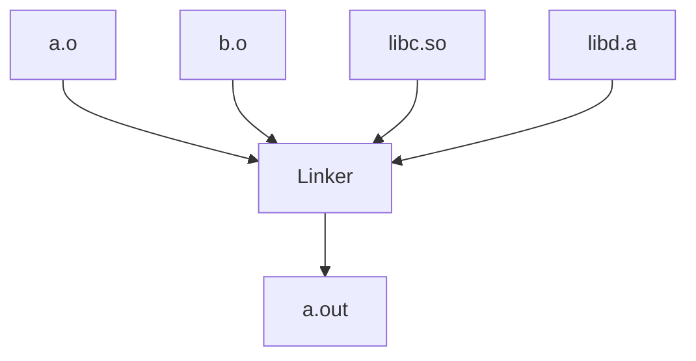
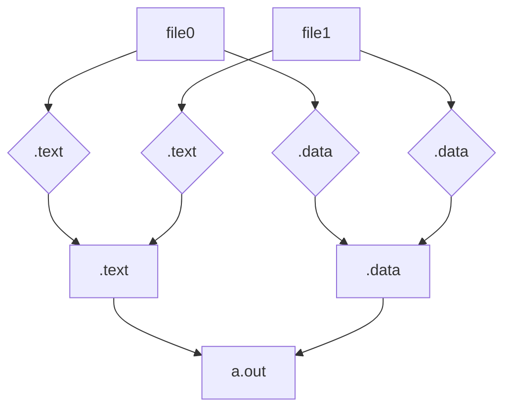
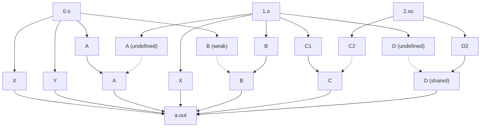

# Implement an ELF linker

MaskRay

---

## Introduction

* Worked on lld codebase since 2018. Maintaining it since lld 9 (now is 17)
* Debugged hundreds of ELF linker issues: internal, Android, ChromeOS, Linux kernel, misc llvm-dev questions
* Studied many `lld/test/ELF/` tests (more than half)
* Read much of llvm-{nm,readobj,objcopy,objdump,...}/musl/FreeBSD/glibc ld.so code: they help understand how the linker output affects consumers
* Filed ~100 binutils bugs

---

## Is it useful to learn linkers? 

* Not fancy as many other toolchain components
* Some basics are useful
* binary utilities
* Object file format, compiler instrumentations

---

## Linkers

Object file formats are very different.

* a.out (extensions): SunOS a.out ld, NetBSD a.out ld, GNU ld
* PE/COFF: MSVC link.exe, GNU ld, lld-link
* XCOFF: AIX linker
* Mach-O: Apple ld64, michaeleisel/zld, ld64.lld, mold/macho
* ELF: Solaris ld, GNU ld, GNU gold, MC linker, ld.lld, mold/elf
* WebAssembly: wasm-ld



---

<div class="grid grid-cols-12">
<div class="col-span-4">

Combine input sections



</div>
<div class="col-span-8">

Symbol resolution

* local symbols: X, Y, ...
* non-local (STB\_GLOBAL or STB\_WEAK) symbols: A, B, ...



</div>
</div>

---

## Generic linker design

* Parse command line options
* Find and scan input files (`.o`, `.so`, `.a`), interleaved with symbol resolution
* Global transforms (section based garbage collection, identical code folding, etc)
* Create synthetic sections
* Map input sections and synthetic (linker-generated) sections into output sections
* Scan relocations
* Layout and assign addresses (thunks, sections with varying sizes, symbol assignments)
* Write headers
* Copy section contents to output and resolve relocations

---

## Find and scan input files

Find input files

* Read and parse input files one by one
* `-L` provides search paths. `-l` looks up them
* `--sysroot` affects `INPUT`/`GROUP` in linker scripts
* `-Bdynamic` finds both .so and .a. `-Bstatic` finds just .a

---

Scan input files, interleaved with symbol resolution

* input files: relocatable object files (`.o`), shared objects (`.so`), archives (`.a`), linker scripts (commonly `.lds` and `.t`)
* File extensions are used by `-l`, but otherwise have no special semantics
* symbols: defined (`.o`), shared (`.so` defined), lazy (`.a` defined), undefined
* Relocatable object files contributes sections, symbols, and relocations
* Shared objects contributes just symbols
* Archives provide so-called lazy definitions: either like unused undefined symbol or archive member extraction

---

### Relocatable object files

* input sections: `.rodata`, `.text`, `.data`, `.bss`, ...
* entries in symbol table (`SHT_SYMTAB`): defined, undefined
* relocations: record them to be scanned later

The local part is file-local while the non-local part requires resolution with other files.

The non-local part consists of `STB_GLOBAL`, `STB_WEAK`, and (GCC specific) `STB_GNU_UNIQUE` symbols.

For each entry, reserve a symbol in the global symbol table if not present yet.

---

### Shared objects

A shared object contributes just symbols to the link process.

* entries in dynamic symbol table (`SHT_DYNSYM`): shared, undefined
* symbol versioning: `SHT_GNU_versym`, `SHT_GNU_verdef`, (for `--no-allow-shlib-undefined` and non-default version symbol export) `SHT_GNU_verneed` (mold < gold < GNU ld ~ ld.lld)
* `DT_SONAME`, (for `--no-allow-shlib-undefined`) `DT_NEEDED`

---

### Archives

This is an ancient trick to decrease linker work: initially every archive member is in a lazy state, if an archive member provides a definition resolving an undefined symbol, it will be extracted.
Extraction may trigger recursive extraction within (default) the archive or (`--start-group`) other archives.

<https://maskray.me/blog/2021-06-20-symbol-processing#archive-processing>

* GNU ld, gold style
* VMS, Apple ld64, MSVC link.exe, ld.lld, mold

GNU ld/gold style is not user-friendly because the `undefined reference` diagnostic is difficult to act on.
However, it has a loose layering check property.

[`ld.lld --warn-backrefs`](https://maskray.me/blog/2021-06-13-dependency-related-linker-options#warn-backrefs)
achieves goods of both worlds

---

### Symbol resolution

How do a non-local symbol interract with another symbol of the name in other object files?

Resolution between two `.o` defined/undefined symbols is associative.
In the absence of weak symbols and duplicate definition errors, the interaction is also commutative.

Resolution between a `.o` and a `.so` is commutative and associative.

Resolution between two `.so` is associative.
If two `.so` don't define the same symbol, the resolution is also commutative.

For an archive symbol, its interaction with any other file kind is neither commutative nor associative.

---

### Symbol representation

* type, binding, visibility, size
* defined (definition in `.o`): section, value; (for bitcode) file
  + to support linker scripts, `section` either an output section or an input section
* undefined (undefined in .o/.so): (for diagnostics) file
* shared (definition in .so): file, (for copy relocations) inferred alignment
* placeholder: `--trace-symbol`, (for symbol versioning) eliminated symbols

---

### What can be parallelized

* initialization of local symbols (embarrassingly parallel)
* initialization of non-local symbols
* symbol resolution

To diagnose relocations referencing a local symbol defined in a discarded section (due to COMDAT rules), a local symbol may be represented as `Undefined`.
We need COMDAT group resolution to decide whether a local symbol is `Defined` or `Undefined`.

Parallelizing section initialization is feasible for relocatable object files but may increase work for archives and lazy object files.
If we know that many archive members will be eventually extracted, eager initializing sections may be a good idea.

---

### mold's parallelism

* Symbol representation needs some atomics
* Symbol resolution needs multiple passes
* `.a .so` vs `.so .a` semantics are not preserved as I like (it works in 99.9% cases)
* In one large executable, I measured:
* 1 thread: 1.3x slower than ld.lld (atomics have costs)
* 2 threads: 1.75x faster than 1 thread
* 4 threads: 3x faster than 1 thread
* 8 threads: 5.3x faster than 1 thread
* 16 threads: 5.4x faster than 1 thread

---

## Global transforms

`--gc-sections`: section based garbage collection (mark and sweep).
[Linker garbage collection](https://maskray.me/blog/2021-02-28-linker-garbage-collection)

In ld.lld, for a `-ffunction-sections` build, GC can take little time (2%) if there is debug information or a lot (10%) when there is little debug information, thanks to the monolithic `.debug_*` design

`--icf`: graph isomorphism problem

---

### ICF

* link.exe: Identical COMDAT Folding
* gold/ld.lld/mold: Identical Code Folding

Algorithms

* pessimistic: gold joins identical sections (pessimistic approach cannot merge some mutual recursive functions) 
* optimistic: ld.lld/mold split distinct sections

ld.lld computes a lightweight message digest for each section, then collects hashes into buckets.
For each bucket, it does pairwise comparison which is easy to reason about and supports condition branches well.

Another idea is to use message digests to fully describe a section (mold).

---

## Create synthetic sections

* `.got`: Global Offset Table
* `.plt`: Procedure Linkage Table
* `.dynsym, .dynstr`: dynamic symbol table and string table
* `.dynamic`: dynamic linkage information
* `.rela.dyn, .rela.plt, .relr.dyn`: dynamic relocations
* `.hash, .gnu.hash`: SysV hash table, GNU hash table
* `.symtab, .strtab`: static symbol table and string table
* section header table, `.shstrtab`

Dynamic sections (`.dynsym, dynstr, .dynamic, .rela.dyn, .rela.plt`) are for dynamic linking

---

## Map input sections and synthetic sections into output sections

* Find output section for each input section (.text.foo -> .text, .rodata.bar -> .bar)
* Combine input sections


---

### Output section descriptions

Linker scripts (a powerful domain specific language): output section descriptions, input section descriptions

```
.text : {
  *(.text .text.*)
}
.data : {
  a.o(.data)
  *:*(.data)
  KEEP(*(EXCLUDE_FILE(*notinclude) .data))
}
.init_array : {
  PROVIDE_HIDDEN (__init_array_start = .);
  KEEP (*(SORT_BY_INIT_PRIORITY(.init_array.*) SORT_BY_INIT_PRIORITY(.ctors.*)))
  ...
}
```

Write a parser inside the linker!

Symbol value: absolute value, input section plus offset, output section plus offset

---

## Scan relocations

* An input section may have a dependent `SHT_REL`/`SHT_RELA`
* Scan relocation sections to decide link-time constants, GOT, PLT, [copy relocations, canonical PLT entries](https://maskray.me/blog/2021-01-09-copy-relocations-canonical-plt-entries-and-protected#summary), TLS dynamic relocations, etc
* Relocations have different kinds

They may result into:

* Link-time constants: resolved
* GOT: .got, .rela.dyn
* PLT: .plt, .got.plt, .rela.plt
* non-preemptible ifunc: [GNU indirect function](https://maskray.me/blog/2021-01-18-gnu-indirect-function)

Linker is a validation tool.

* Error checking: undefined reference, relocation overflow, PC-relative referencing `SHN_ABS` in PIC links, relocation referencing a discarded section

---

### Scan relocations (cont)

Some architectures have unfortunate rules: Hexagon TLS, Mips multi-GOT, PowerPC .got2

* GOT optimization: x86-64 `R_X86_64_REX_GOTPCRELX`, (recent) AArch64, PowerPC64 TOC
* `.plt.got` optimization
* RISC-V linker relaxation may or may not be placed here
* stack machine: LoongArch, 3 old architectures in binutils

---

### Parallel relocation scan

mold's parallel scan (some atomics, out-of-order diagnostics):

* 1 thread: 2.35x faster than ld.lld
* 2 threads: 1.88x faster than 1 thread
* 4 threads: 3.28x faster than 1 thread
* 16 threads: 11.13x faster than 1 thread

---

Why is ld.lld slow?
I think fundamentally it is because ld.lld does more work.
It has more dispatches and abstraction costs (e.g. virtual function), and provides more diagnostics and handles many tricky cases that mold doesn't do:

* support all of REL/RELA/mips64el for one architecture (even if the architecture typically doesn't use REL)
* use a generic relocation expression (RelExpr) design which costs two virtual functions processing one relocation
* GNU ifunc
* retain otherwise unused `.got` and `.got.plt` in edge cases
* ...

With little debug information, in ld.lld --threads={1,2,4,8}, relocation scan takes 11~15% of total time.
IMO parallism does not pay off if we don't optimize other critical paths.

---

## Layout and assign addresses

* Compute the initial address
* Get output section sizes
* Assign addresses to output sections and symbols
* Assign addresses to input sections, data commands, and symbols
* Text sections may be interspersed with range-extension thunks
* Variable size sections (`SHT_RELR`): Mach-O avoided the problem by placing load commands at the end

Linker scripts

* `.` and symbol assignments, data commands in linker scripts
* virtual address and load address
* VMA/LMA memory region

---

### Assign addresses to output sections and symbols

```cpp
for (SectionCommand *cmd : sectionCommands) {
  if (auto *assign = dyn_cast<SymbolAssignment>(cmd)) {
    assign->addr = dot;
    assignSymbol(assign, false); // outside an output section description
  } else {
    assignOffsets(cast<OutputSection>(cmd));
  }
}
```

---

### Assign addresses to input sections, data commands, and symbols

The representation of an input section includes a `parent` pointer to the output section and an offset within in output section.

```cpp
for (SectionCommand *cmd : sec->commands) {
  if (auto *assign = dyn_cast<SymbolAssignment>(cmd)) {
    // .text : { ... sym = .; }
    assign->addr = dot;
    assignSymbol(assign, true); // in an output section description
  } else if (auto *data = dyn_cast<ByteCommand>(cmd)) {
    // .text : { ... BYTE(0) }
    data->offset = dot - sec->addr;
    dot += data->size;
  } else {
    // .text : { ... *(.text) }
    for (InputSection *isec : cast<InputSectionDescription>(cmd)->sections) {
      dot = alignTo(dot, isec->alignment);
      isec->outSecOff = dot - sec->addr; // offset within the output section
      dot += isec->getSize();
    }
  }
}
```

---

### Range extension thunks

veneers/stub groups/range extension thunks

Every new arch needs to think about this

* stability: GNU ld < gold < ld.lld
* ld64 branch islands

---

## Write headers

* ELF header
* program headers: linker scripts can make the placement complex
* section header table

---

## Copy section contents to output

* Copy input section contents to output sections
  + The content of a synthetic section needs computing
* Resolve relocations
* Compress sections

---

## Other features

* `.eh_frame`
* [`SHF_LINK_ORDER`](https://maskray.me/blog/2021-01-31-metadata-sections-comdat-and-shf-link-order)
* section groups
* `-Map`: link map
* `--cref`: cross reference table
* `--why-extract`: why is an archive member extracted?

---

## Design choices

* Abstraction to support both ELFCLASS32 and ELFCLASS64: Do symbol/section structs need templates? Do functions need templates?
* Abstraction to support both little-endian and big-endian (big-endian systems have declined 90% in the last ten years)
* Support all architectures in one build? gold, ld.lld, and mold do. GNU ld needs -m
* Support both REL/RELA as input/output for one arch? ld.lld does. GNU ld, gold, and mold don't
* Global states vs explicit context parameter
* Portability, platform differences
* Standalone executable or library

---

## Link-time optimization

* Report symbol resolution result to the compiler
* Pass optimization/code generation options to the compiler

---

## Reading list

Videos

* _New LLD linker for ELF_ &nbsp;&nbsp; Rui Ueyama, 2016 EuroLLVM
* _What makes LLD so fast?_ &nbsp;&nbsp; by Peter Smith, FOSDEM 2019

Books, articles

* _Linkers and Loaders_ &nbsp;&nbsp; John R. Levine
* Ian Lance Taylor's 20 part Linker posts
* <https://wiki.freebsd.org/LLD>
* <https://maskray.me/blog/tags/linker/>

---

## mold

With multi-threading, why is it faster than ld.lld?

Ordered by my rough estimate of importance:

* `SHF_MERGE` duplicate elimination
* parallel symbol table initialization (major)
* eager loading of archive members and lazy object files
* parallel relocation scan
* faster synthetic sections
* parallel `--gc-sections`
* parallel symbol resolution
